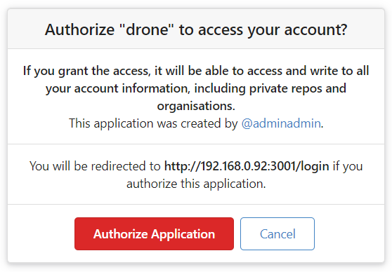
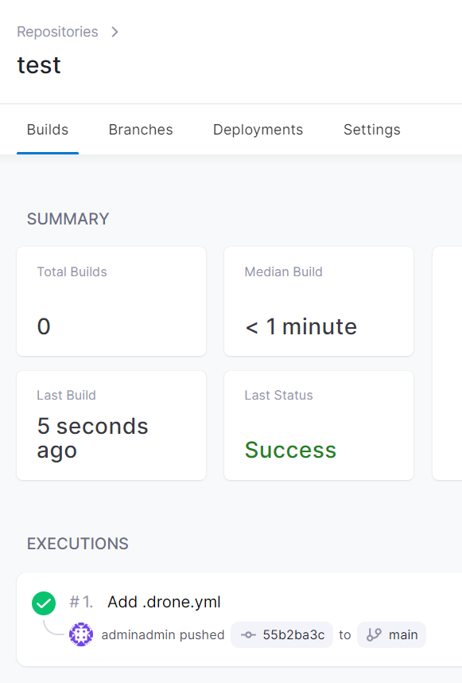

# drone-gitea-on-docker


DroneCI and Gitea in Docker.

## Usage

> P.S. replace all `IP_ADDRESS` by your IP of machine!

Config `boot.sh` by instructions in it.

Now boot the stack:

```bash
bash boot.sh
```

1. Go to `http://IP_ADDRESS:3000` and configure Gitea. DONT FORGET - press THIS button (otherwise the Drone will not be able to communicate with Gitea):

   

2. Register and login into Gitea.

3. Head over to: `http://IP_ADDRESS:3000/user/settings/applications` and create a new OAuth2 Application and set the Redirect URI to `http://IP_ADDRESS:3001/login` like this:

   

4. Copy the client id and client secret (WARNING: you won't get a chance to see them again), save settings and paste id and secret to the `boot.sh` in `DRONE_GITEA_CLIENT_ID` and `DRONE_GITEA_CLIENT_SECRET` and run `bash boot.sh` again. This will give drone the correct credentials in order to authenticate with Gitea.

   

5. Now when you head over to `http://IP_ADDRESS:3001/` and press "Continue" button.

6. You will be asked to authorize the application and you should be able to access drone. Press button with title like "Authorize":

   

7. Then register in Drone (Fear not, this is a local account!):

   

### Build your first pipeline

1. Create a test repo in Gitea.

2. Commit a `.drone.yml` file for Drone with contents from `.drone-example.yml`.

3. Head over to Drone admin panel and sync your repositories:

   

4. Activate your repository:

   

5. Push a commit to master and see your pipeline running:

   

### Drone CLI (optional)

1. Install Drone CLI (<https://docs.drone.io/cli/install/>).

2. Get your Drone Token on `http://${IP_ADDRESS}:3001/account`.

3. Run commands:

   ```bash
   export DRONE_SERVER=http://IP_ADDRESS:3001
   export DRONE_TOKEN=Token from step 2
   drone info
   ```

## More Examples (OLD! Use at your own risk!)

- <https://github.com/ruanbekker/drone-ci-testing>
- <https://github.com/ruanbekker/drone-demo-python-flask>
- <https://github.com/ruanbekker/drone-with-go>
- <https://github.com/ruanbekker/demo-drone-mongodb-tests>
- <https://github.com/ruanbekker/drone-multi-pipeline>
- <https://github.com/ruanbekker/docker-jekyll-drone>
- [Localstack with Drone and Gitea](https://gist.github.com/ruanbekker/84cb9f0c2a21434ca8381a0c74842d84)
- [Drone, Minio, Gitea, Sqlite on Docker Compose](https://gist.github.com/ruanbekker/3847bbf1b961efc568b93ccbf5c6f9f6)
